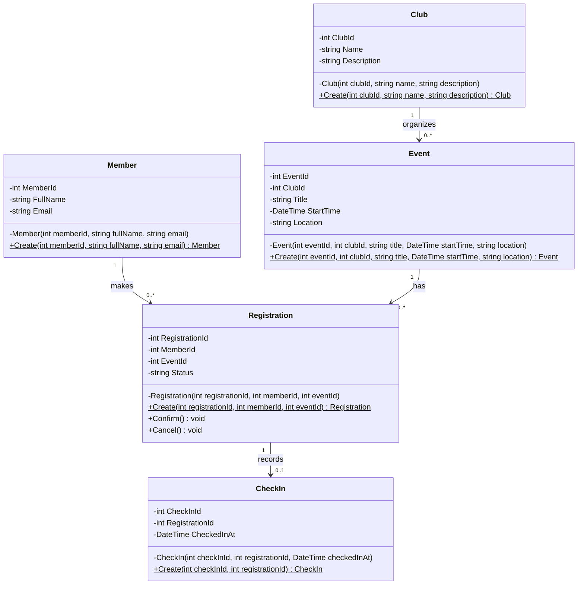

# EduHub Ch01 - Class Diagram

```mermaid
classDiagram
    class Club {
        -int ClubId
        -string Name
        -string Description
        -Club(int clubId, string name, string description)
        +Create(int clubId, string name, string description)$ Club
    }

    class Member {
        -int MemberId
        -string FullName
        -string Email
        -Member(int memberId, string fullName, string email)
        +Create(int memberId, string fullName, string email)$ Member
    }

    class Event {
        -int EventId
        -int ClubId
        -string Title
        -DateTime StartTime
        -string Location
        -Event(int eventId, int clubId, string title, DateTime startTime, string location)
        +Create(int eventId, int clubId, string title, DateTime startTime, string location)$ Event
    }

    class Registration {
        -int RegistrationId
        -int MemberId
        -int EventId
        -string Status
        -Registration(int registrationId, int memberId, int eventId)
        +Create(int registrationId, int memberId, int eventId)$ Registration
        +Confirm() void
        +Cancel() void
    }

    class CheckIn {
        -int CheckInId
        -int RegistrationId
        -DateTime CheckedInAt
        -CheckIn(int checkInId, int registrationId, DateTime checkedInAt)
        +Create(int checkInId, int registrationId)$ CheckIn
    }

    Club "1" --> "0..*" Event : organizes
    Member "1" --> "0..*" Registration : makes
    Event "1" --> "0..*" Registration : has
    Registration "1" --> "0..1" CheckIn : records
```
